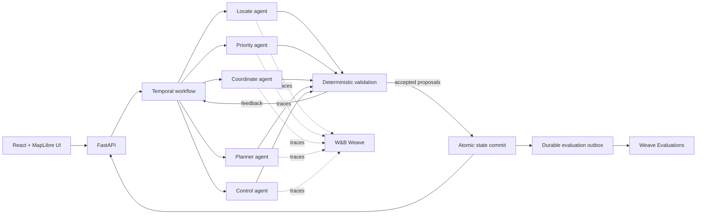

# KentoAgent

> Durable, observable, and evaluated multi-agent coordination for earthquake-response
> simulations.

KentoAgent demonstrates how a team of AI agents can coordinate safely when model calls are
concurrent, infrastructure can retry work, and proposed actions may conflict. Five specialists
locate survivors, prioritize urgency, coordinate assignments, plan routes, and reject unsafe
actions while a live MapLibre operations console visualizes the simulation.

Temporal provides durable execution and replay safety. Deterministic validation remains the
authority for every state change. W&B Weave captures agent traces and publishes each completed
workflow as a structured evaluation with one row per logical coordination step.

KentoAgent uses seeded synthetic scenarios. It is a research and demonstration system, not a
source of live disaster information or an emergency-response decision system.

## Why KentoAgent?

Most multi-agent demos focus on whether the agents eventually produce a plausible answer.
KentoAgent focuses on the harder operational questions:

- What happens when an agent Activity is retried by the infrastructure?
- Can validation request another reasoning round without confusing it with a system retry?
- How are stale, duplicate, or conflicting proposals prevented from changing state?
- Can an operator pause, resume, or stop the system without losing workflow progress?
- Can every committed step be evaluated and audited after execution?

The result is a production-shaped multi-agent architecture with explicit durability, safety,
observability, and evaluation boundaries.

## Key features

- **Five specialized agents:** localization, triage, coordination, route planning, and safety
  control run concurrently.
- **Durable execution:** Temporal records workflow history, retries Activities, supports
  pause/resume/stop signals, and continues long executions safely.
- **Deterministic guardrails:** model proposals are validated before one atomic world-state
  commit.
- **Step-level Weave evaluations:** one workflow becomes one Weave evaluation; each committed
  application step becomes one dataset row.
- **Optional orchestration judge:** a strict structured-output judge grades the complete
  multi-agent trajectory, not only the final outcome.
- **Operational UI:** React, MapLibre, and FastAPI provide a real-coordinate map, mission metrics,
  and durable workflow controls.
- **Reproducible offline path:** seeded scenarios and mock agents support credential-free testing.
- **Experiment workspace:** Marimo notebooks support simulation, inference, debugging, and
  evaluation exploration.

## System architecture



Temporal Workflow code performs deterministic orchestration only. Model calls, persistence, and
Weave publication happen in Activities, outside the replay-sensitive Workflow boundary.

## Agent team

| Agent | Responsibility |
| --- | --- |
| Locate | Discover and update visible survivor information. |
| Priority | Rank survivor urgency from the available evidence. |
| Coordinate | Assign responders and manage inter-agent handoffs. |
| Planner | Produce routes that account for hazards and blocked roads. |
| Control | Approve safe actions and reject invalid or conflicting proposals. |

Each agent returns typed proposals. Validation may accept part of a round and selectively retry
only the roles responsible for rejected proposals.

## Weave evaluations

KentoAgent publishes production-shaped Temporal runs to the **Evaluations** page in W&B Weave:

- one terminal Temporal workflow is one `Evaluation.evaluate` run;
- one logical application step is one named dataset row;
- the evaluated model label records the provider, agent model, and prompt version;
- `kentoagent_deterministic_step_v1` contains deterministic coordination metrics; and
- `kentoagent_orchestration_judge_v1` contains the optional semantic judge result.

Deterministic metrics include valid actions, state changes, convergence, orchestration rounds,
agent-call counts, selective retries, feedback and handoff completion, duplicate proposals,
stale results, conflicts, no-op calls, Temporal retries, schema repairs, duplicate side effects,
step validity, and latency.

The optional judge scores seven dimensions from 0 to 4:

1. role specialization;
2. information flow;
3. handoff quality;
4. feedback adaptation;
5. coordination efficiency;
6. decision coherence; and
7. termination correctness.

The judge uses a strict response schema and may cite only identifiers present in the compact
trajectory. Invalid or refused judge output becomes `not_evaluable`; it does not discard the
deterministic evaluation.

See [Observability and evaluation](docs/observability-and-evaluation.md) for the full record,
retry, privacy, and delivery semantics.

## Quick start: full application

### Prerequisites

- Python 3.11 or newer
- [`uv`](https://docs.astral.sh/uv/)
- Node.js 20 or newer
- [Temporal CLI](https://docs.temporal.io/cli)
- A W&B account and API key for remote Weave publication
- An OpenAI API key for the model-backed workflow and optional judge

Install the project:

```powershell
uv sync --extra dev --extra agents --extra lab
npm --prefix frontend install
Copy-Item .env.example .env
```

Add the following settings to `.env`. Replace the credential and account placeholders with real
values; never commit the resulting `.env` file.

```dotenv
# Agent inference
OPENAI_API_KEY=your-openai-api-key

# W&B Weave
KENTO_WEAVE_MODE=required
KENTO_ENVIRONMENT=development
WANDB_ENTITY=your-wandb-user-or-team-slug
WANDB_PROJECT=kentoagent
WANDB_API_KEY=your-wandb-api-key

# Per-step production evaluations
KENTO_STEP_EVAL_ENABLED=true
KENTO_STEP_EVAL_DETERMINISTIC=true
KENTO_STEP_EVAL_LLM_JUDGE=true
KENTO_STEP_EVAL_JUDGE_MODEL=gpt-4.1
KENTO_STEP_EVAL_RUBRIC_VERSION=orchestration-v1
KENTO_STEP_EVAL_PROMPT_VERSION=orchestration-v1
KENTO_STEP_EVAL_PASS_THRESHOLD=70
KENTO_STEP_EVAL_PUBLICATION_MODE=terminal_outbox
KENTO_STEP_EVAL_FAILURE_POLICY=fail_open
KENTO_STEP_EVAL_LEDGER_PATH=.kentoagent/step-evaluations.sqlite3
```

Make sure `WANDB_MODE=offline` is not set when you want results published remotely.

Start the application in four terminals from the repository root.

**Terminal 1 - Temporal development server**

```powershell
temporal server start-dev
```

**Terminal 2 - KentoAgent Temporal worker**

```powershell
uv run --env-file .env kentoagent-temporal-worker
```

**Terminal 3 - FastAPI server**

```powershell
uv run --env-file .env uvicorn kentoagent.api.app:app `
  --reload `
  --host 127.0.0.1 `
  --port 8000
```

**Terminal 4 - React frontend**

```powershell
npm run dev
```

Open <http://localhost:5173>, choose a new scenario seed, and select **Start five-LLM
workflow**. The frontend proxies `/api` requests to FastAPI on port 8000.

Step records are written after each commit and published when the workflow reaches a terminal
state. Let the run complete or select **Stop LLMs** after at least one step. The worker prints a
direct link to the resulting Weave evaluation. You can also open the W&B project and navigate to
**Weave -> Evaluations**.

Temporal's local UI is available at <http://localhost:8233>.

## Local durable smoke test

For a quick workflow test without model calls or remote telemetry, set:

```dotenv
KENTO_WEAVE_MODE=local
KENTO_STEP_EVAL_ENABLED=true
KENTO_STEP_EVAL_LLM_JUDGE=false
```

Start Temporal and the worker, then run:

```powershell
uv run --env-file .env kentoagent-temporal-start `
  --seed 49281 `
  --provider mock `
  --max-steps 1 `
  --step-interval 0 `
  --wait
```

The deterministic simulator can also run without Temporal:

```powershell
uv run kentoagent simulate --seed 49281 --steps 25
```

## Seeded system evaluations

The step evaluations above measure production workflow coordination. KentoAgent also contains a
separate seeded evaluation suite for repeatable policy comparisons.

Run it locally:

```powershell
uv run python -m kentoagent.eval --runs 50 --seed 42
```

Publish it as a native Weave evaluation:

```powershell
uv run --env-file .env python -m kentoagent.eval `
  --runs 50 `
  --seed 42 `
  --weave `
  --policy-version deterministic-v1
```

## Marimo labs

```powershell
uv run marimo run marimo/simulation_playground.py
uv run marimo run marimo/agent_debugger.py
uv run marimo run marimo/evaluation_lab.py
uv run marimo run marimo/inference_lab.py
```

## Tests

```powershell
uv run pytest
npm test
npm run lint
```

The test suite covers deterministic guardrails, orchestration behavior, API responses, Temporal
Activity retries, validation-driven retries, schema repair, continue-as-new, replay safety,
evaluation deduplication, partial publication, strict judge output, and telemetry outages. Tests
run with remote Weave publication disabled and do not call real LLMs.

## Repository layout

```text
src/kentoagent/
  agents/          Specialist behavior and model adapters
  api/             FastAPI application and durable-run endpoints
  durable/         Temporal Workflows, Activities, worker, and client
  evaluation/      Guardrails, scorers, Weave publishing, and outbox ledger
  observability/   Weave initialization and trace policy
  orchestration/   Deterministic observe/plan/validate/act loop
  simulation/      Typed world state, scenarios, routing, and GeoJSON
  storage/         Local and optional Snowflake storage boundaries
frontend/          React and MapLibre operations console
marimo/            Interactive simulation and evaluation labs
docs/              Architecture, observability, and data-layer notes
tests/             Unit, integration, and Temporal replay tests
```

## Technology stack

- **Orchestration:** Temporal Python SDK
- **Agents:** LlamaIndex `FunctionAgent` with OpenAI or deterministic mocks
- **Observability and evaluation:** W&B Weave
- **Backend:** Python, FastAPI, Pydantic
- **Frontend:** React, TypeScript, Vite, MapLibre
- **Research environment:** Marimo
- **Optional data layer:** Snowflake and dbt

## Safety and production notes

- Simulation state is synthetic and seeded; the map does not represent live emergency data.
- Deterministic validation--not an LLM judge--decides whether actions may change state.
- Complete world snapshots, credentials, raw prompts, and hidden reasoning are excluded from
  step-evaluation rows.
- Evaluation publication is stable-ID, at-least-once delivery. A crash after Weave accepts a row
  but before the local ledger commit can resend that row.
- The default SQLite ledger is suitable for one local worker. Multiple worker replicas require a
  shared durable volume or a transactional database-backed ledger.
- The Temporal development server is for local development only. Use Temporal Cloud or a
  production self-hosted cluster for deployment.

For deeper implementation details, read [Architecture](docs/architecture.md), [Observability and
evaluation](docs/observability-and-evaluation.md), and [Snowflake data layer](docs/snowflake-data-layer.md).
